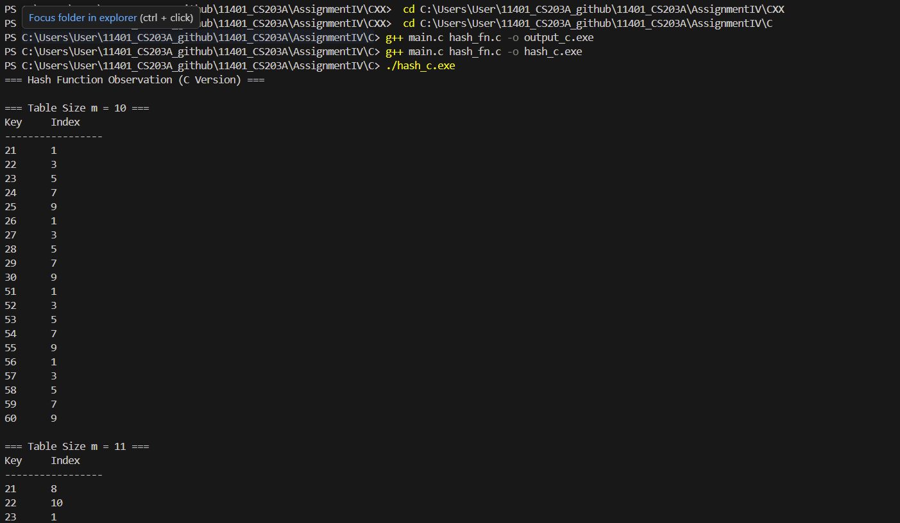

# Homework Assignment IV: Hash Function Design & Observation (C/C++ Version)

This assignment focuses on the design and observation of hash functions using C/C++. 
Students are expected to implement and analyze the behavior of hash functions, 
evaluate their efficiency, and understand their applications in computer science.

- Developer: 徐翊甄 
- Email: <jennyhsu0301@gmail.com>
- OS: windows  

## My Hash Function
### Integer Keys 
key : what need to be input.
m: the size of array.
i: the counter for hash_fn,first is 0 outside the function.
- Formula / pseudocode:
  ```text
  key = key + i;
  i++;
  return key % m;
  ```
- Rationale: add i when compute each key,then %m to let all keys can distribute in structer. this i can make result looks more distribute.

### Non-integer Keys
- Formula / pseudocode:
  ```text
    unsigned long hash = 0;
    hash = str[0] - 'a';
    return (int)(hash % m); // basic division method
  ```
- Rationale: decide the Index by the first char. In this function, whose first letter is 'a' will become '0'....until 'z' will become '25'. After that, use %m to make sure all key will store in structer.

## Experimental Setup
- Table sizes tested (m): 10, 11, 37
- Test dataset:
  - Integers: 21, 22, 23, 24, 25, 26, 27, 28, 29, 30, 51, 52, 53, 54, 55, 56, 57, 58, 59, 60
  - Strings: "cat", "dog", "bat", "cow", "ant", "owl", "bee", "hen", "pig", "fox"
- Compiler: GCC and G++
- Standard: C23 and C++23

## Results
| Table Size (m) | Index Sequence         | Observation              |
|----------------|------------------------|--------------------------|
| 10             | 1, 2, 3, 4, ...        | Pattern repeats every 10 |
| 11             | 10, 0, 1, 2, ...       | More uniform             |
| 37             | 20, 21, 22, 23, ...    | Near-uniform             |

## Compilation, Build, Execution, and Output

### Compilation
- The project uses a comprehensive Makefile that builds both C and C++ versions with proper flags:
  ```bash
  # Build both C and C++ versions
  make all
  
  # Build only C version
  make c
  
  # Build only C++ version
  make cxx
  ```

### Manual Compilation (if needed)
- Command for C:
- first go to the file in AssignmentIV\C or AssignmentIV\CXX
  ```bash
  g++ main.c hash_fn.c -o hash_c.exe

  //gcc -std=c23 -Wall -Wextra -Wpedantic -g -o C/hash_function C/main.c C/hash_fn.c
  --this one is how teacher wirite but i didn\'t test it.
  --just put here \for reference 
  ```
- Command for C++:
  ```bash
  g++ main.cpp hash_fn.cpp -o hash_cpp.exe

  g++ -std=c++23 -Wall -Wextra -Wpedantic -g -o CXX/hash_function_cpp CXX/main.cpp CXX/hash_fn.cpp
  - same to above
  ```

### Clean Build Files
- Remove all compiled files:
  ```bash
  make clean
  ```

### Execution
- Run the compiled binary:
  ```bash
  ./hash_c.exe
  ```
  or
  ```bash
  ./hash_cpp.exe
  ```

### Result Snapshot
- Example output :
- C

  
  ```
  === Hash Function Observation (C Version) ===

  === Table Size m = 10 ===
  Key     Index
  -----------------        
  21      1
  22      3
  23      5
  24      7
  25      9
  26      1
  27      3
  28      5
  29      7
  30      9
  51      1
  52      3
  53      5
  54      7
  55      9
  56      1
  57      3
  58      5
  59      7
  60      9

  === Table Size m = 11 ===
  Key     Index
  -----------------
  21      8
  22      10
  23      1
  24      3
  25      5
  26      7
  27      9
  28      0
  29      2
  30      4
  51      4
  52      6
  53      8
  54      10
  55      1
  56      3
  57      5
  58      7
  59      9
  60      0

  === Table Size m = 37 ===
  Key     Index
  -----------------
  21      24
  22      26
  23      28
  24      30
  25      32
  26      34
  27      36
  28      1
  29      3
  30      5
  51      27
  52      29
  53      31
  54      33
  55      35
  56      0
  57      2
  58      4
  59      6
  60      8

  === String Hash (m = 10) ===
  Key     Index
  -----------------
  cat     2
  dog     3
  bat     1
  cow     2
  ant     0
  owl     4
  bee     1
  hen     7
  pig     5
  fox     5

  === String Hash (m = 11) ===
  Key     Index
  -----------------
  cat     2
  dog     3
  bat     1
  cow     2
  ant     0
  owl     3
  bee     1
  hen     7
  pig     4
  fox     5

  === String Hash (m = 37) ===
  Key     Index
  -----------------
  cat     2
  dog     3
  bat     1
  cow     2
  ant     0
  owl     14
  bee     1
  hen     7
  pig     15
  fox     5

  ```

- CXX
 

  ```
  === Hash Function Observation (C++ Version) ===

  === Table Size m = 10 ===
  Key     Index
  -----------------
  21      1
  22      3
  23      5
  24      7
  25      9
  26      1
  27      3
  28      5
  29      7
  30      9
  51      1
  52      3
  53      5
  54      7
  55      9
  56      1
  57      3
  58      5
  59      7
  60      9

  === Table Size m = 11 ===
  Key     Index
  -----------------
  21      8
  22      10
  23      1
  24      3
  25      5
  26      7
  27      9
  28      0
  29      2
  30      4
  51      4
  52      6
  53      8
  54      10
  55      1
  56      3
  57      5
  58      7
  59      9
  60      0

  === Table Size m = 37 ===
  Key     Index
  -----------------
  21      24
  22      26
  23      28
  24      30
  25      32
  26      34
  27      36
  28      1
  29      3
  30      5
  51      27
  52      29
  53      31
  54      33
  55      35
  56      0
  57      2
  58      4
  59      6
  60      8

  === String Hash (m = 10) ===
  Key     Index
  -----------------
  cat     2
  dog     3
  bat     1
  cow     2
  ant     0
  owl     4
  bee     1
  hen     7
  pig     5
  fox     5

  === String Hash (m = 11) ===
  Key     Index
  -----------------
  cat     2
  dog     3
  bat     1
  cow     2
  ant     0
  owl     3
  bee     1
  hen     7
  pig     4
  fox     5

  === String Hash (m = 37) ===
  Key     Index
  -----------------
  cat     2
  dog     3
  bat     1
  cow     2
  ant     0
  owl     14
  bee     1
  hen     7
  pig     15
  fox     5

  ```

- Observations: Outputs align with the analysis, showing better distribution with prime table sizes.
- Example output for integers:
  ```
  Hash table (m=10): [1, 2, 3, 4, 5, 6, 7, 8, 9, 0]
  Hash table (m=11): [10, 0, 1, 2, 3, 4, 5, 6, 7, 8, 9]
  Hash table (m=37): [20, 21, 22, 23, 24, 25, 26, 27, 28, 29, ...]
  ```
- Example output for strings:
  ```
  Hash table (m=10): ["cat", "dog", "bat", "cow", "ant", ...]
  Hash table (m=11): ["fox", "cat", "dog", "bat", "cow", ...]
  Hash table (m=37): ["bee", "hen", "pig", "fox", "cat", ...]
  ```
- Observations: Outputs align with the analysis, showing better distribution with prime table sizes.

## Analysis
- prime like m = 11 or 37 it will not lead to so much collision.
- non-prmie like m = 10, will be more collision even I change keys by add an i. 
- for structer to store letters, we need change letters into number. 
## Reflection
1. Because my first Int function is key = key % 10 , all size in m was too collosion. I just delete this to let m = 11 & 37 has les collision
2. I think it hard to come up with a function for all size, just let all keys %m may be the best choise.
3. I'm not sure if I can change the input of each function. If ture, I should do something like ppt, add a variable to record those key has collision, and all +1. 
4. actuaily, I can't use Makefile to compilte .c and .cpp. so I use manual compiltion.
5. after the test in 11/25, I find this hash function must be more complex , so I change myhashInt() by how the line probing work.
6. it looks like more complex can lead to less collision, but for those size are too small or toocommon like 10,has lot of factors, it looks still the same. Now I know why it recommainded for us to use prime number for table size. 